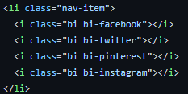

UI frameworks make web development so much easier.
## User Interfaces and Frameworks
User Interfaces, or UIs, are the bridges between man and machine. They allow us to communicate and interact with computers in order to send and receive information, complete a computation, and so much more. As devices with access to the internet has grown exponentially over the last decade, so too has the importance of great UIs, especially its role in creating informative and easy to navigate websites.

UI frameworks allow us to stylize a web page without having to spend countless hours figuring out the minute details in the hyper-text markup language (HTML) file or the cascading style sheets (CSS) file by creating useful and intuitive shortcuts that allow you to focus on web development instead of micro-managing every aspect of it. One UI framework that I just learned within the last week, but have already come to appreciate its usefulness, is Bootstrap5.
## Bootstrap 5
Bootstrap 5 is a UI framework that allows us to easily organize and stylize sections of our webpage as we so desire. Bootstrap 5 also allows us to modify the theme of our webpage or insert popular icons and embed them with links, as shown in the picture in the right. One powerful tool that Bootstrap utilizes that I find very convenient is its grid system. Using Bootstrap's grid system, we are able to divide a section of a web page, or the entire page itself, into rows and columns. We are then able to place any elements or text inside a column, and then modify the column, such as changing its aligning, its margin and padding, its background color, text color, and so much more. This compartmentalizing of a web page allows us to easily stylize it compared to using just HTML and CSS. If however we want to fine tune every aspect and control every detail within our website, using HTML and CSS without Bootstrap may be the way too go. 

## The Payoff
While it has only been about a week since I began using Bootstrap 5, I have come to appreciate its usefulness in UI design. It has helped me to compartmentalize my webpage into portions by using rows and columns that I am then able to control much more easily compared to just HTML and CSS. While the documentation may seem daunting at first, and there are a lot of new things that you will have to learn, using a UI framework will enhance your web development skills greatly.