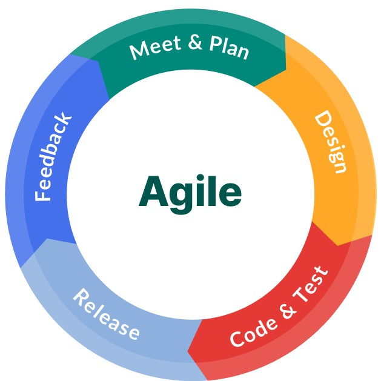

When I first enrolled in this class I knew that I would be learning about software engineering but I did not know what exactly to expect. Now that this class is almost over, it seems like the only thing I learned about was Javascript and HTML web development. But now that I think about it more, I learned so many simple things just by doing it every day. Two examples of this are coding standards and agile project management.

## The Importance of Coding Standards

Every language has a grammar structure to ensure that it is understandable to its users. Not following a language’s grammar structure is a good way to confuse others and yourself about what you are trying to say. The same can also be said for programming languages. Coding standards , which ensures proper grammar for programming languages, allow others to understand your code, so that they know what is going on when it works, and especially when it doesn’t work, they can attempt to resolve the errors. Using ESLint in IntelliJ IDEA has been one of the most enlightening things that I have ever done in software engineering. Previously, I have only used PuTTy to access Wiliki and VS Code. While VS Code is a good Integrated Development Environment (IDE), it does not compare to IntelliJ. IntelliJ ensures that my code has no errors written in it and that proper coding standards are enforced. This has made coding really easy to read and understand, saving me a lot of time and making it easy to conform to a coding standard.

## Agile Project Management

One other thing that I learned a lot this semester was the agile project management concept. The agile project management concept is an interactive approach to software development in order to receive feedback as quickly as possible and integrate these changes. I learned a similar concept to this in my ENGR 401 class called the lean startup methodology, which was somewhat based on the agile project management concept. This concept allowed my team to quickly create and improve our website, Rainbow Notes, for our final project. It also allowed team members to work on different parts of the project and then incorporate them over time to quickly add functionality to the project. The agile project management concept is what allowed my team to create a successful website and receive feedback from other people quickly in order to figure out what needs to be improved upon.

## One Door Closes and Many More Open

While my journey as a student in computer engineering at UH Manoa is coming to an end, this is just the beginning. The lessons I learned throughout my college career have prepared me well for the software engineering world by giving me the tools to succeed. As I venture out into the real world, I will always remember and utilize what I learned at UH Manoa developing my software engineering skills and will continue to practice it for the foreseable future.
