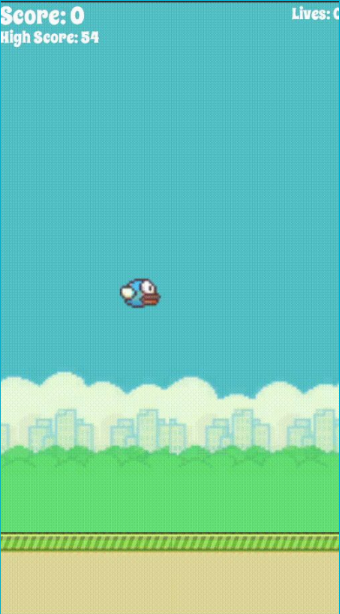
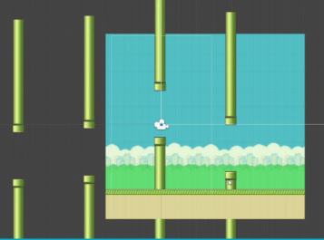
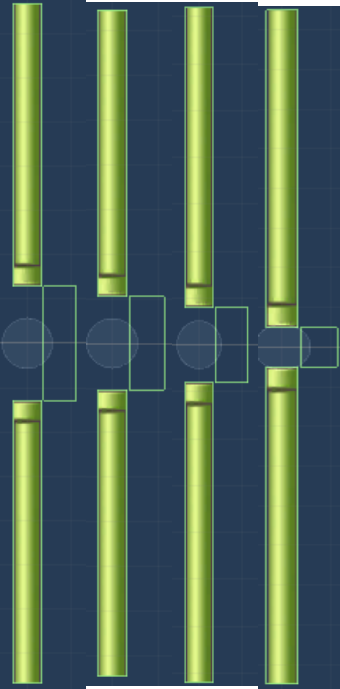
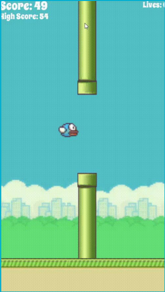

 
To implement the game, I first wanted to create the background, and the bird, along with the GUI. Then, I needed the bird to react to gravity and move upward slightly when the screen is tapped or the mouse right clicker. The next idea was to create an endless game by making the background move from right to left and then move another instance of the background back to the right. 
Flappy Bird 2 is an endlass game I developed using C# in Unity. It includes multiple difficulty levels: easy, medium, hard, and infuriating, along with a life system. In the future I hope to implement many more features into the game.

 The next task was to implement the pipes. These pipes would need to have hitboxes attached to them that would trigger the game to stop and bird to fall to its death. The pipes would also have to have a hitbox for the area between the pipes and slightly to the right of it that triggers an increment to the score. Every 50 points, an extra life would be added so that if you do hit the pipes, the game would restart but with your current score saved. What made implementing the pipes rather difficult was that it used the same scrolling function as the background so that it moved at the same speed, however, we do not want the pipes to reappear on the right side and come back into the screen along with the randomly generated pipes. To rectify this, I set the pipes to delete after it reaches a set position off-screen, so that it does not reappear on the right. 

   The game also implements multiple difficulties, where the space between the pipes would continually get smaller as the difficulty increases. This game was rather challenging to create because I had to do it alone, but with time and perseverance, I accomplished what I initially wanted to, with many more features hopefully to come in the future. 