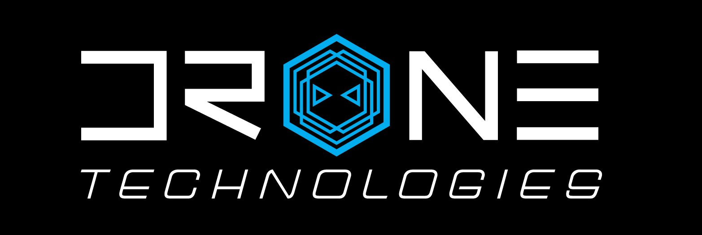

## University of Hawaii Drone Technologies

The University of Hawaii Drone Technologies, or UHDT, is a vertically integrated project designed for undergraduate students, specifically in the Department of Electrical and Computer Engineering, and Department of Mechanical Engineering, to partake in a student-run project to develop real-world skills. UHDT competes at an annual competition caleld the AUVSI SUAS Competition which seeks to mimic the conditions of search and rescue via autonomous unmanned vehicles.

## UAV Subsystem

For my first two semesters, I was a part of the UAV subsystem. My main job was to ensure the proper function of the A* pathfinding algorithm in MATLAB which was used to avoid virtual stationary obstacles during competition. Then I was tasked with upgrading it to 2.5D and incorporating the height of obstacles along with the altitude of the waypoints. 
     After my promotion to UAV Software Subsystem Lead, I was tasked with leading testing and deployment of the A* pathfinding algorithm. However, that did not come to fruition as AUVSI recently changed their competition to no longer include stationary virtual obstacles later in the year. As UAV Software Lead, I also became familiar with the hexacopter, methods of troubleshooting, and how to conduct flight tests, which proved valuable to the team. However, since obstacle avoidance is no longer required, I began thinking about how I can help the team at competition. This led me to work with the Image Processing subsystem, to integrate Object Detection Classification and Localization (ODCL) during the mission demonstration of the portion of the competition. The hexacopter should be able to fly autonomously and take thousands of pictures of an area of the field and send those images to our ODCL script to detect and identify objects on the ground.

## The Future of UHDT
As both a member and lead on the team, I have gained valuable insights nost just in algorithm deployment and autonomous vehicles, but teamwork and leadership as well. I have greatly increased my presentation and technical writing skills immensely while having a great time working on drones. While working in UHDT has been extremely difficult and time consuming, I look forward to continuing to work for the team and help deliver a drone that will one day place first at competition.